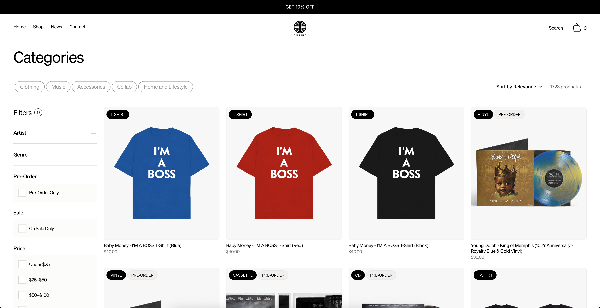
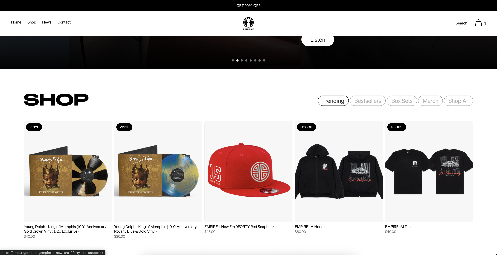
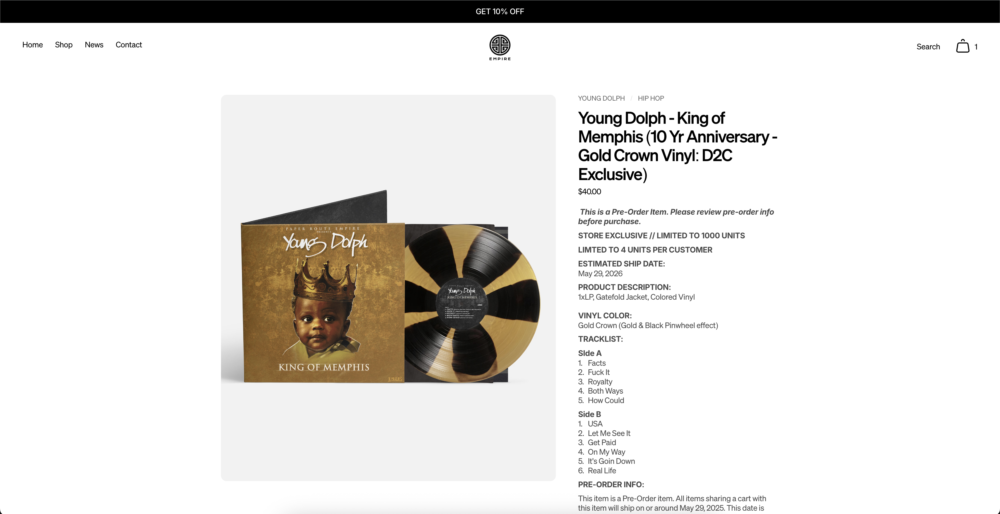
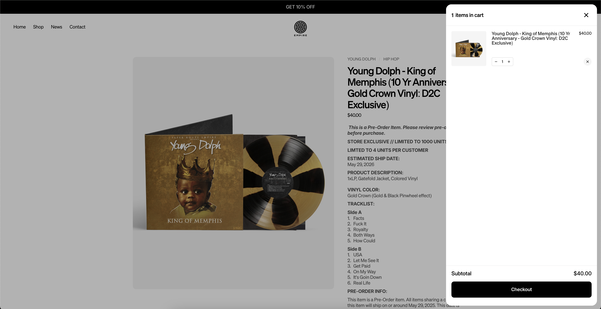
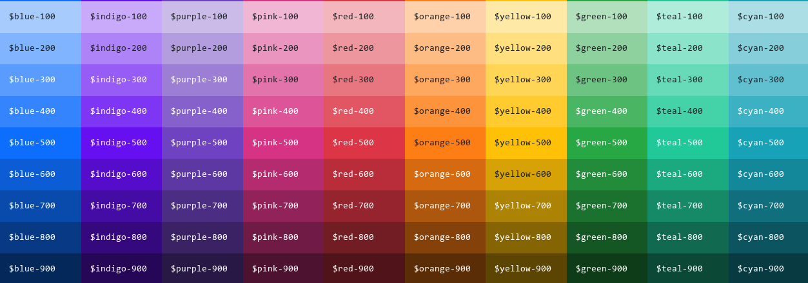
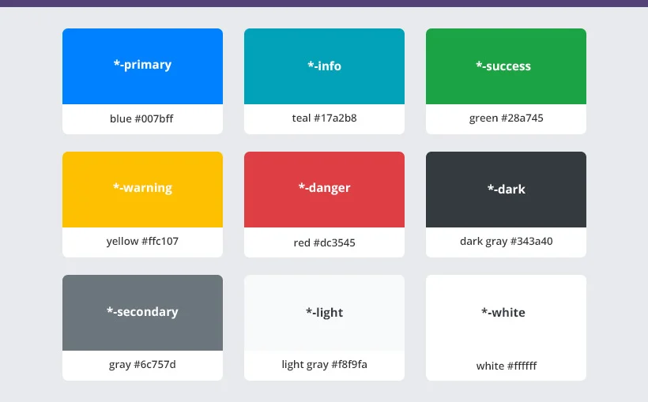

# Frontend Style Guide GenC Store

## Design Inspiration

[E-commerce website](https://empi.re/)

### Landing Page

### Shop

### Product

### Cart

## Color palette - WCAG AA Compliant

### Primaries

| Variable  | Values    |
| :-------- | :-------- |
| `$blue`   | `#0d6efd` |
| `$indigo` | `#6610f2` |
| `$purple` | `#6f42c1` |
| `$pink`   | `#d63384` |
| `$red`    | `#dc3545` |
| `$orange` | `#fd7e14` |
| `$yellow` | `#ffc107` |
| `$green`  | `#198754` |
| `$teal`   | `#20c997` |
| `$cyan`   | `#0dcaf0` |

### Derivates

Meant for UI states.

| Variable     | Value       |
| :----------- | :---------- |
| `$primary`   | `$blue`     |
| `$secondary` | `$gray-600` |
| `$success`   | `$green`    |
| `$info`      | `$cyan`     |
| `$warning`   | `$yellow`   |
| `$danger`    | `$red`      |
| `$light`     | `$gray-100` |
| `$dark`      | `$gray-900` |

### Generals

Meant for backgrounds etc.

| Variable    | Values    |
| :---------- | :-------- |
| `$white`    | `#fff`    |
| `$gray-100` | `#f8f9fa` |
| `$gray-200` | `#e9ecef` |
| `$gray-300` | `#dee2e6` |
| `$gray-400` | `#ced4da` |
| `$gray-500` | `#adb5bd` |
| `$gray-600` | `#6c757d` |
| `$gray-700` | `#495057` |
| `$gray-800` | `#343a40` |
| `$gray-900` | `#212529` |
| `$black`    | `#000`    |
